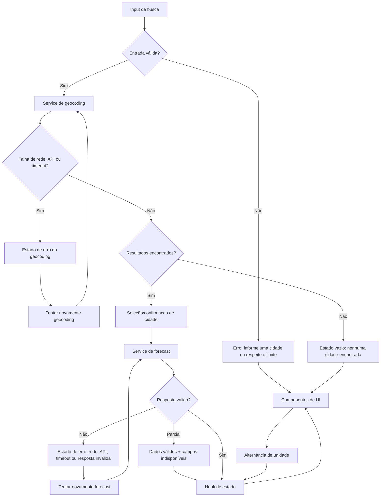

# Plano Técnico — Weather App

Este plano deriva da especificação em `specs/weather-app-spec.md`. Ele define
arquitetura, contratos e decisões para a implementação da v1; não define o
código final.

## Architecture

A aplicação será uma SPA React mobile-first com cinco camadas, cada uma com
uma responsabilidade clara e dependências em uma única direção:

```text
components (apresentação)
        |
hooks (orquestração e estado)
        |
services (acesso a dados e integração HTTP) ---- Open-Meteo
        |
utils (funções puras e regras de domínio)
        |
types (contratos compartilhados do app)
```

- **`components/` — apresentação:** renderiza formulário, resultados de
  geocoding, clima atual, previsão, unidade e estados de loading/vazio/erro.
  Recebe dados e callbacks por props; não conhece URLs, `fetch`, concorrência
  ou regras de parsing.
- **`hooks/` — orquestração/estado:** coordena o fluxo busca → seleção →
  previsão, retry, unidade e estado discriminado. Controla `AbortController` e
  `operationId` para impedir que respostas antigas atualizem a tela. Não contém
  markup nem regras de apresentação.
- **`services/` — acesso a dados:** monta requisições Open-Meteo, aplica timeout
  de 8 segundos, classifica HTTP/rede e converte payloads externos por meio de
  parsers. Não acessa React nem estado global.
- **`utils/` — domínio e funções puras:** valida entrada, converte temperaturas,
  traduz códigos WMO, associa arrays diários, formata datas no timezone e
  mantém regras de normalização. Não executa efeitos colaterais nem depende do
  navegador.
- **`types/` — contratos compartilhados:** define interfaces e tipos públicos do
  app, incluindo `City`, `WeatherData`, erros e estado do fluxo. Mantém os
  contratos em um único lugar e evita duplicação entre UI, hook e services.

O fluxo permitido é `components → hooks → services → utils → types`. Componentes
não chamam serviços diretamente, serviços não atualizam componentes e `utils`
não conhece a camada de integração. Essa restrição mantém o comportamento
determinístico e reduz o acoplamento. A organização também respeita as
convenções do projeto: `src/components`, `src/hooks`, `src/services` e
`src/types` são os locais primários para UI, orquestração, dados e contratos.

Cada operação recebe um identificador de geração. Somente a geração atual pode
alterar o estado, garantindo que respostas antigas não sobrescrevam uma busca
mais recente. A requisição anterior também deve ser abortada quando houver uma
nova operação.

## Tech Stack

- **TypeScript strict + React 19:** tipos explícitos para contratos externos e
  componentes funcionais com hooks, conforme a base existente.
- **Vite:** desenvolvimento e build da SPA.
- **Tailwind CSS:** estilos responsivos e estados visuais consistentes com o
  tema dark glassmorphism já configurado.
- **Vitest + Testing Library:** testes unitários de domínio/serviços e testes
  de comportamento dos componentes com foco em acessibilidade.
- **Playwright:** fluxos E2E nos navegadores da matriz de compatibilidade.
- **Biome:** lint e formatação já definidos no projeto.
- **Fetch nativo:** não adicionar cliente HTTP; os requisitos são atendidos por
  `AbortController`, `URLSearchParams` e um wrapper de timeout.
- **Open-Meteo:** geocoding e previsão públicos, sem chave, autenticação ou
  backend próprio.

## Project Structure

```text
src/
  components/
    SearchForm.tsx          # entrada e submissão por callback
    LocationResults.tsx     # confirmação de uma ou várias localidades
    WeatherPanel.tsx        # clima atual e previsão
    UnitToggle.tsx          # Celsius/Fahrenheit acessível
    StatusMessage.tsx       # loading, vazio e erro com retry
  hooks/
    useWeatherApp.ts        # coordenação do fluxo, estado e concorrência
  services/
    geocodingService.ts     # busca de localidades no Open-Meteo
    forecastService.ts      # busca de previsão no Open-Meteo
    http.ts                 # fetch, timeout e classificação HTTP
  types/
    weather.ts              # City, WeatherData, AppError e tipos do domínio
    api.ts                  # contratos externos e payloads, quando necessários
  utils/
    validation.ts           # validação da entrada e payloads
    temperature.ts          # conversões e arredondamento
    weatherCodes.ts         # códigos WMO -> descrição pt-BR
    dates.ts                # datas no timezone da localidade
    forecast.ts             # normalização dos arrays diários
  App.tsx
  main.tsx

tests/
  unit/                     # domínio, parsers e serviços
  components/               # comportamento acessível da UI
  e2e/                      # fluxos principais com Playwright
```

`App.tsx` compõe o hook e os componentes, mas não deve absorver regras de
domínio ou chamadas HTTP. A separação é deliberadamente pequena: `http.ts`
centraliza o comportamento comum de rede, enquanto os dois serviços expressam
os contratos específicos de cada endpoint. Novos serviços só devem ser criados
quando houver uma integração distinta.

Essa estrutura facilita os testes: `utils` pode ser testada com entradas e
saídas diretas; `services` pode usar `fetch` mockado sem renderizar React;
`hooks` pode ser testado com serviços substitutos para concorrência, retry e
transições de estado; e `components` pode usar Testing Library para validar
semântica, acessibilidade e interação sem depender da rede.

## Data Model

Os modelos abaixo são contratos de domínio em `src/types/`. Respostas da API não
devem ser expostas diretamente à UI. As temperaturas são armazenadas
canonicamente em Celsius e convertidas somente na apresentação.

```ts
export type Unit = 'celsius' | 'fahrenheit';

export interface City {
  /** Identificador da localidade retornado pelo geocoding. */
  id?: number;

  /** Nome da cidade retornado pelo geocoding. */
  name: string;

  /** Latitude usada na consulta da previsão. */
  latitude: number;

  /** Longitude usada na consulta da previsão. */
  longitude: number;

  /** Fuso horário usado para identificar "Hoje". */
  timezone: string;

  /** Estado ou região administrativa, quando disponível. */
  region?: string;

  /** País da localidade, quando disponível. */
  country?: string;
}

export interface CurrentWeather {
  /** Temperatura atual em Celsius, conforme current.temperature_2m. */
  temperatureCelsius: number;

  /** Código meteorológico WMO, conforme current.weather_code. */
  weatherCode: number;

  /** Descrição do código WMO traduzida para pt-BR. */
  condition: string;
}

export interface ForecastDay {
  /** Data local no formato YYYY-MM-DD, conforme daily.time. */
  date: string;

  /** Temperatura mínima em Celsius, conforme daily.temperature_2m_min. */
  minimumCelsius?: number;

  /** Temperatura máxima em Celsius, conforme daily.temperature_2m_max. */
  maximumCelsius?: number;

  /** Código meteorológico WMO, conforme daily.weather_code. */
  weatherCode?: number;

  /** Descrição do código WMO traduzida para pt-BR. */
  condition?: string;

  /** Indica se o período possui os dados necessários para exibição. */
  available: boolean;

  /** Campos obrigatórios ausentes neste período. */
  missingFields: Array<'date' | 'minimum' | 'maximum' | 'condition'>;
}

export interface WeatherData {
  /** Cidade selecionada para a consulta. */
  city: City;

  /** Condições meteorológicas atuais. */
  current: CurrentWeather;

  /** Cinco posições: hoje e os quatro dias seguintes. */
  forecast: ForecastDay[];

  /** Unidade escolhida para a apresentação dos valores. */
  unit: Unit;
}

export type AppErrorCode =
  | 'invalid-input' | 'too-long' | 'empty-results' | 'timeout'
  | 'rate-limit' | 'service-unavailable' | 'invalid-response';

export interface AppError {
  /** Categoria estável usada pela UI e pela observabilidade. */
  code: AppErrorCode;

  /** Mensagem compreensível apresentada ao usuário. */
  message: string;

  /** Indica se a operação pode ser repetida. */
  retryable: boolean;
}
```

Contratos externos mínimos:

- Geocoding: `results[]` deve conter `name`, `latitude`, `longitude` e
  `timezone`; `admin1` e `country` são opcionais.
- Forecast: `current.temperature_2m` e `current.weather_code` são obrigatórios;
  `daily.time`, `daily.temperature_2m_min`, `daily.temperature_2m_max` e
  `daily.weather_code` precisam ter estrutura de arrays compatível. A estrutura
  diária ausente ou incoerente invalida toda a resposta. Valores ausentes em
  uma posição válida geram indisponibilidade apenas naquele período/campo.

`forecast` deve sempre conter cinco posições. Datas ou campos ausentes são
marcados em `missingFields`; uma estrutura diária ausente ou incoerente invalida
a resposta inteira. Assim, alternar unidades não acumula erro de arredondamento.

## Data Flow



1. O usuário submete o formulário. O hook normaliza apenas espaços laterais,
   preserva acentos, hífens e apóstrofos, e valida vazio e limite de 100
   caracteres.
2. Para uma entrada válida, o hook cria uma nova geração, cancela a operação
   anterior e chama `searchLocations(query, signal)`.
3. O serviço monta a URL de geocoding com `name`, `count=10`, `language=pt` e
   `format=json`, aplica timeout de 8 segundos e normaliza os resultados.
4. Sem resultados, o estado vira vazio. Com um ou mais resultados, a UI mostra
   opções; mesmo um resultado exige confirmação explícita.
5. Ao selecionar uma localidade, o hook inicia uma nova operação de forecast,
   usando nome, coordenadas e timezone da seleção. A previsão anterior deixa
   de ser o resultado atual enquanto a nova tentativa carrega.
6. O serviço chama o endpoint de forecast, valida a resposta e o parser cria o
   modelo com cinco posições. Faltas de períodos/campos são marcadas, mas uma
   estrutura diária inválida gera erro.
7. A UI apresenta o clima atual e os cinco dias. Cada temperatura é convertida
   do Celsius canônico para a unidade selecionada e arredondada para inteiro.
8. Retry repete geocoding ou forecast conforme a última operação falha, usando
   a consulta/localidade armazenada, sem recarregar a página.

## External APIs

### Geocoding

`GET https://geocoding-api.open-meteo.com/v1/search`

Parâmetros relevantes:

| Parâmetro | Valor/uso |
| --- | --- |
| `name` | Texto completo ou parcial informado pelo usuário. |
| `count` | `10`, limite máximo de localidades retornadas. |
| `language` | `pt`, para priorizar metadados em português. |
| `format` | `json`. |

Exemplo resumido de resposta:

```json
{
  "results": [
    {
      "id": 3448439,
      "name": "São Paulo",
      "latitude": -23.5475,
      "longitude": -46.63611,
      "timezone": "America/Sao_Paulo",
      "admin1": "São Paulo",
      "country": "Brasil",
      "country_code": "BR"
    }
  ],
  "generationtime_ms": 0.42
}
```

Mapeamento para `City`: `id`, `name`, `latitude`, `longitude` e `timezone` são
copiados diretamente; `admin1` alimenta `region`, `country` alimenta `country`
e `country_code` pode ser preservado se o contrato for estendido. Uma localidade
só é válida quando possui nome, latitude, longitude e timezone. `results` vazio
gera o estado “Nenhuma cidade encontrada”, sem chamar forecast.

### Forecast

`GET https://api.open-meteo.com/v1/forecast`

Parâmetros relevantes:

| Parâmetro | Valor/uso |
| --- | --- |
| `latitude` | Latitude da `City` selecionada. |
| `longitude` | Longitude da `City` selecionada. |
| `current` | `temperature_2m,weather_code`, condições atuais necessárias. |
| `daily` | `temperature_2m_min,temperature_2m_max,weather_code`, dados diários necessários. |
| `forecast_days` | `5`, hoje e os quatro dias seguintes. |
| `timezone` | `auto`, para retornar datas no fuso da localidade. |

Exemplo resumido de resposta:

```json
{
  "latitude": -23.55,
  "longitude": -46.63,
  "timezone": "America/Sao_Paulo",
  "current": {
    "time": "2026-09-16T14:00",
    "temperature_2m": 22.4,
    "weather_code": 2
  },
  "daily": {
    "time": ["2026-09-16", "2026-09-17", "2026-09-18"],
    "temperature_2m_min": [16.1, 17.0, 18.2],
    "temperature_2m_max": [25.4, 26.0, 27.1],
    "weather_code": [2, 61, 1]
  }
}
```

Mapeamento para o modelo:

- `current.temperature_2m` alimenta `CurrentWeather.temperatureCelsius`.
- `current.weather_code` alimenta `CurrentWeather.weatherCode`; o domínio
  traduz o código para `CurrentWeather.condition` em pt-BR.
- As posições paralelas de `daily.time`, `daily.temperature_2m_min`,
  `daily.temperature_2m_max` e `daily.weather_code` formam cada `ForecastDay`.
  `time[i]` vai para `date`, mínimas e máximas vão para os campos em Celsius,
  e o código é traduzido para `condition`.
- O parser cria sempre cinco posições em `WeatherData.forecast`. Se a fonte
  retornar menos posições, as restantes ficam indisponíveis; se faltar um valor
  em uma posição existente, `missingFields` registra o campo sem ocultar os
  outros dias válidos.
- `City` vem da seleção de geocoding e permanece em `WeatherData.city`; o
  timezone da resposta confirma o fuso usado na formatação de `date` e na
  identificação de “Hoje”. `WeatherData.unit` começa como `celsius` e não vem
  da API.

O parser considera o timezone retornado pela resposta/localidade para identificar
“Hoje”. Os códigos WMO serão agrupados assim: `0` céu limpo; `1..3`
parcialmente nublado; `45,48` nevoeiro; `51..57` garoa; `61..67` chuva;
`71..77` neve; `80..82` pancadas de chuva; `85,86` pancadas de neve;
`95,96,99` tempestade. Qualquer código desconhecido vira “Condição
indisponível”, sem inventar uma descrição.

Ambos os serviços usam `fetch` com `AbortController` e deadline de 8 segundos.
HTTP `429` é `rate-limit`; `5xx`, falhas de rede e payloads incompatíveis são
indisponibilidade/resposta inválida; o timeout tem mensagem própria.

## Visual Design and Presentation

A interface permanece mobile-first e adota o tema dark glassmorphism já
configurado, mas deixa de tratar a previsão como texto corrido. A composição
deve separar claramente busca, seleção de localidade, condição atual e previsão
diária, permitindo reconhecer a informação principal sem percorrer a página.
Esta decisão dá suporte direto a RF3 e RF4, preservando os estados previstos em
RF6, RF7 e RF8.

### Direção visual

- **Fundo da aplicação:** `bg-night-900` com uma textura atmosférica discreta
  criada por camadas CSS em tons de `night-800`, sem gradientes ou elementos
  decorativos que reduzam o contraste. O conteúdo fica centralizado em uma
  coluna de leitura de até `max-w-5xl`, com espaçamento vertical consistente.
- **Superfícies:** busca, resultados, estados e previsão usam
  `bg-white/5 backdrop-blur-md border border-white/10 shadow-glass`. Cartões
  têm raio de no máximo `rounded-lg` e padding responsivo. Divisores
  `border-white/10` separam cabeçalho, condição atual e a grade, evitando que
  os quadros pareçam uma única área contínua.
- **Hierarquia:** o nome da cidade e o contexto geográfico aparecem no
  cabeçalho da previsão; a temperatura atual é o elemento de maior escala; a
  condição e as mínimas/máximas são secundárias. A unidade usa controle
  segmentado compacto ao lado do cabeçalho em desktop e abaixo dele em mobile.
- **Cores semânticas:** texto primário branco, texto secundário em branco com
  opacidade e `text-sun` reservado para temperaturas e condições ensolaradas.
  Estados de foco mantêm `accent-400`; erro, vazio e carregamento recebem ícone
  e cor semântica acessível, sem depender apenas da cor para comunicar o estado.

### Imagens e ícones meteorológicos

Cada condição recebe uma ilustração raster local, não uma imagem remota por
dia. Isso garante carregamento previsível, evita dependência de terceiros e
preserva a privacidade da consulta. Os assets ficam em
`src/assets/weather/` e usam WebP com fallback PNG quando o ambiente de build
ou compatibilidade exigir. A imagem representa a condição, e não uma cidade ou
foto genérica de banco de imagens.

O mapeamento é derivado exclusivamente do grupo WMO já definido no domínio:

| Grupo WMO | Asset | Uso visual |
| --- | --- | --- |
| `0` | `clear.webp` | sol/céu aberto |
| `1..3` | `partly-cloudy.webp` | nuvens parciais |
| `45,48` | `fog.webp` | nevoeiro |
| `51..57` | `drizzle.webp` | garoa |
| `61..67` | `rain.webp` | chuva |
| `71..77` | `snow.webp` | neve |
| `80..82` | `showers.webp` | pancadas de chuva |
| `85,86` | `snow-showers.webp` | pancadas de neve |
| `95,96,99` | `storm.webp` | tempestade |
| desconhecido/indisponível | `unavailable.webp` | condição indisponível |

Uma função pura `getWeatherVisual(weatherCode?: number)` em
`src/utils/weatherVisuals.ts` retorna `{ src, alt }`, usando `alt=""` quando a
imagem apenas reforça a descrição textual e um `alt` descritivo quando for a
única representação da condição. `WeatherVisual.tsx` encapsula a imagem e suas
dimensões estáveis. O painel atual usa versão de destaque; cada cartão diário
usa miniatura. A UI nunca infere um asset da descrição em texto nem inventa uma
imagem para código WMO desconhecido.

### Componentes e layout

- **`App.tsx`:** organiza uma barra superior de busca e o conteúdo em seções
  com margens e divisores. O resultado meteorológico somente é exibido em uma
  área própria, distinta de resultados de geocoding e mensagens de estado.
- **`SearchForm.tsx`:** vira uma superfície horizontal em telas `sm` ou maiores,
  com campo flexível e botão de comando. Em mobile mantém o campo e o botão em
  largura confortável, sem cortar texto ou reduzir a área de toque.
- **`LocationResults.tsx`:** apresenta cada cidade como item clicável de lista,
  com bordas entre itens e metadados de região/país em linha secundária. O item
  selecionável ocupa toda a largura e possui hover, foco e estado pressionado.
- **`StatusMessage.tsx`:** usa uma superfície contextual separada com ícone e
  `role` atual. Loading inclui indicador visual não textual; erro deixa o retry
  em destaque; vazio orienta a nova busca sem competir com a previsão antiga.
- **`UnitToggle.tsx`:** é um controle segmentado com `aria-pressed`, aparência
  ativa distinta e dimensões constantes para não deslocar o layout.
- **`WeatherPanel.tsx`:** usa um cartão de resumo para localidade e condição
  atual, com imagem de destaque, descrição e temperatura. A previsão fica em
  seção posterior, separada por divisor e título, em
  `grid grid-cols-2 sm:grid-cols-3 lg:grid-cols-5 gap-3`. Cada dia é um cartão
  individual com data localizada, miniatura, condição e bloco de mínima/máxima
  claramente rotulado. Dias indisponíveis mantêm a posição e a moldura, exibem
  `unavailable.webp` e o texto existente de indisponibilidade.

As imagens devem declarar `width` e `height` ou usar um contêiner com
`aspect-ratio` fixo para evitar layout shift. A grade reserva a mesma altura
para todos os cartões; descrições longas quebram em linhas sem sobrepor as
temperaturas. Em desktop, o resumo atual pode usar duas colunas internas; em
mobile, imagem e texto ficam empilhados. Não serão inseridos cards dentro de
cards: o resumo atual e cada dia são superfícies independentes.

### Contratos adicionais de apresentação

```ts
export interface WeatherVisual {
  src: string;
  alt: string;
}

export function getWeatherVisual(weatherCode?: number): WeatherVisual;
```

`WeatherVisual` depende apenas de `weatherCode`, portanto pode ser testado sem
React. Os componentes continuam recebendo `WeatherData` e `ForecastDay`; nenhum
novo campo é adicionado ao contrato da API ou ao estado do hook. A formatação de
data deve converter `YYYY-MM-DD` em rótulo pt-BR curto, usando o timezone da
localidade e substituindo apenas o primeiro período por “Hoje” quando aplicável.

### Validação visual e acessível

Além da estratégia geral de testes, a entrega da estilização deve verificar:

- cada grupo WMO e o fallback retornam o asset esperado;
- imagens decorativas não duplicam a descrição para leitores de tela e imagens
  informativas possuem texto alternativo adequado;
- cartões de previsão, resultados e mensagens têm separação visível e foco de
  teclado com contraste suficiente;
- os cinco cartões mantêm leitura e ausência de rolagem horizontal em `375x667`;
- em desktop, a grade apresenta cinco colunas e não amplia os cartões além do
  conteúdo útil;
- screenshots Playwright em mobile e desktop confirmam assets renderizados,
  ausência de sobreposição e preservação da hierarquia em loading, erro, vazio
  e sucesso.

## State Management

O estado fica local ao fluxo principal, em `useWeatherApp`, sem Redux, contexto
global ou persistência. O hook é a única fonte de verdade da consulta atual e
expõe ao `App.tsx` dados e callbacks prontos para os componentes.

Um estado discriminado torna explícitos os estados possíveis e evita combinações
inválidas:

```ts
type AppState =
  | { kind: 'idle'; query: string }
  | {
      kind: 'loading';
      operation: 'search' | 'forecast';
      query: string;
      location?: City;
      operationId: number;
    }
  | { kind: 'success'; data: WeatherData }
  | { kind: 'empty'; query: string }
  | {
      kind: 'error';
      error: AppError;
      retry: RetryOperation;
    };

type RetryOperation =
  | { kind: 'search'; query: string }
  | { kind: 'forecast'; city: City };
```

`idle` representa a tela inicial sem operação. `loading` representa tanto a
busca de cidades quanto a consulta meteorológica, diferenciadas por
`operation`; durante forecast, `location` identifica a cidade selecionada.
`success` contém somente a previsão atual válida, `empty` representa geocoding
sem resultados e `error` contém uma falha classificável e sua operação de retry.

O campo de busca e a unidade podem ser estados locais do hook. A unidade começa
em `celsius`, pode mudar durante qualquer estado e permanece durante a sessão.
O `WeatherData` mantém temperaturas em Celsius; a renderização deriva os
valores exibidos sem novo request:

```ts
function displayTemperature(
  celsius: number,
  unit: Unit,
): number {
  const value = unit === 'fahrenheit'
    ? (celsius * 9) / 5 + 32
    : celsius;

  return Math.round(value);
}
```

O componente recebe `data.current.temperatureCelsius` e os campos Celsius de
cada `ForecastDay`, aplica `displayTemperature` e exibe `°C` ou `°F`. A troca
de unidade atualiza apenas o estado de apresentação; não refaz geocoding,
forecast ou parsing. Um refresh reinicia a aplicação e a unidade volta para
Celsius.

## Error Handling

O tratamento converte falhas de integração e validação em `AppError`, sem
lançar erros não tratados para a UI. O serviço identifica a categoria e o hook
faz a transição para `error` somente se a operação ainda for a mais recente.

- **Entrada inválida:** não chama API; exibe “Informe o nome de uma cidade”.
  Entradas acima de 100 caracteres são rejeitadas antes do envio com orientação
  sobre o limite.
- **Rede:** falha de conexão, `5xx` ou resposta incompatível gera
  `service-unavailable` e “Não foi possível consultar o serviço”.
- **Limite/indisponibilidade do provedor:** HTTP `429` gera `rate-limit` e
  “Serviço temporariamente indisponível”.
- **Timeout:** cada request usa deadline de 8 segundos e `AbortController`;
  depois disso gera `timeout` e “A consulta demorou mais que o esperado”.
- **Resposta inválida:** ausência de temperatura/condição atuais, ou ausência
  de estrutura diária associável, gera `invalid-response` e “Não foi possível
  consultar o serviço”.
- **Resposta parcial:** com a estrutura diária válida, uma posição ou campo
  ausente não invalida os demais dias. O parser marca `missingFields` e a UI
  exibe o período/campo como indisponível, sem inventar valores. Um código WMO
  desconhecido vira “Condição indisponível”, mas não invalida o período.
- **Estado vazio:** `results: []` gera `empty` e “Nenhuma cidade encontrada”,
  mantendo o formulário disponível e sem solicitar forecast.
- **Retry:** erros retryable exibem “Tentar novamente”. O hook repete a busca
  ou forecast registrado em `RetryOperation`, limpa o resultado anterior e não
  apresenta dados antigos como resultado da nova tentativa.
- **Concorrência:** cada operação incrementa `operationId`; respostas tardias
  são ignoradas e `AbortError` de uma operação substituída não vira erro visível.
- **Comunicação e observabilidade:** loading, erro e vazio usam regiões
  semânticas/live regions e foco acessível. Logs registram somente categoria,
  operação, horário e identificador não pessoal de requisição.

## Testing Strategy

Esta estratégia combina testes rápidos e determinísticos de unidade/componente
com um conjunto menor de fluxos integrados. Cada decisão é testada na camada
mais próxima de sua implementação; o E2E valida o contrato entre camadas.

### Vitest e Testing Library

**Funções puras em `lib/`:**

- conversão Celsius/Fahrenheit, arredondamento e temperaturas negativas, zero e
  decimais;
- todos os grupos de códigos WMO e o fallback “Condição indisponível”;
- entrada vazia, espaços, limite de 100 caracteres e preservação de acentos,
  hífens e apóstrofos;
- normalização de localização e forecast, incluindo timezone, cinco posições,
  arrays desalinhados, campos ausentes e dados parciais;
- identificação de “Hoje” no timezone da cidade.

**Services com `fetch` mockado:**

- URL e parâmetros exatos de geocoding e forecast;
- payload válido e mapeamento para os contratos de domínio;
- timeout de 8 segundos, abortamento, falha de rede, HTTP `429`, `5xx` e JSON
  incompatível;
- validação antes de expor o payload externo ao hook.

**Hooks e componentes:**

- estados `idle`, `loading`, `empty`, `error` e `success`;
- loading distinto para geocoding e forecast, confirmação de localidade única e
  seleção explícita entre homônimos;
- retry preservando consulta/localidade e limpando resultado antigo;
- concorrência com resposta fora de ordem e alteração de unidade durante
  loading, sem novo request;
- `SearchForm`, `LocationResults`, `WeatherPanel`, `UnitToggle` e
  `StatusMessage` consultados por roles, labels e mensagens acessíveis;
- teclado, foco, `aria-live` e ausência de previsão para respostas inválidas.

Os testes de componente não dependem da rede: services são substituídos por
funções mockadas para verificar o hook isoladamente. Fixtures de payload podem
ser compartilhadas entre parser e services para manter um único contrato de
dados.

### Playwright

Os testes E2E cobrem os fluxos que atravessam formulário, hook, services e UI.
As respostas Open-Meteo são interceptadas com fixtures determinísticas; um
teste de integração real pode ser opcional, pois dependeria da disponibilidade
e do conteúdo variável do provedor.

Fluxos principais:

- busca válida com um resultado, confirmação e previsão de cinco dias;
- busca parcial com múltiplos resultados, distinção por região/país e seleção;
- cidade inexistente, entrada vazia, espaços e limite de caracteres;
- loading, timeout, erro de rede, `429`, resposta inválida e retry;
- conversão Celsius/Fahrenheit em todos os valores sem nova requisição;
- buscas concorrentes, mantendo somente o resultado mais recente;
- navegação por teclado e percepção das mensagens de estado.

Cada fluxo visual principal deve rodar em viewport mobile, por exemplo
`375x667`, e em viewport desktop. A suíte verifica ausência de rolagem
horizontal, legibilidade dos cinco dias, foco visível e controles utilizáveis
em telas estreitas. A matriz de navegadores do Playwright cobre os navegadores
definidos no requisito de compatibilidade.

Comandos de verificação do projeto: `pnpm lint`, `pnpm build`, `pnpm test` e
`pnpm test:e2e`.

## Risks & Trade-offs

| Risco/decisão | Trade-off e mitigação |
| --- | --- |
| Dependência de Open-Meteo | Sem backend, chave ou custo operacional; timeout, retry, classificação HTTP e estados explícitos reduzem o impacto da indisponibilidade. |
| Respostas parciais e mudanças de contrato | Parser estrito para estrutura e tolerante por período; testes com fixtures inválidas evitam dados inventados. |
| Concorrência entre consultas | `AbortController` + `operationId` acrescenta pouca complexidade e garante RF10 mesmo se o provedor ignorar abortamento. |
| Estado local | É suficiente para uma única tela e evita over-engineering; o hook concentra a coordenação para permitir testes. |
| Celsius canônico | Exige conversão na renderização, mas evita conversões acumuladas e inconsistência entre clima atual e previsão. |
| Data e timezone | Formatar datas a partir do timezone retornado evita identificar “Hoje” pelo fuso do dispositivo; a lógica deve ser coberta com fixtures de fronteira. |
| Sem cache/persistência | Simplifica privacidade e coerência com a spec, mas cada nova consulta depende da rede. |
| Observabilidade no frontend | Logs mínimos podem ser enviados pelo mecanismo de deploy sem criar backend; a retenção, alertas e armazenamento centralizado ficam como responsabilidade operacional da publicação, fora do domínio da UI. |
| Acessibilidade e responsividade | Exigem estados semânticos, foco, contraste e testes em viewports; isso aumenta o trabalho de UI, mas é requisito de liberação e não deve ser postergado. |
| Estado local vs. Redux/Zustand | Estado local e um hook são suficientes para uma única tela e reduzem dependências; uma store global só seria justificável com múltiplas telas ou estado compartilhado. |
| Fetch nativo vs. cliente HTTP | `fetch` evita dependência adicional e atende timeout/abortamento; Axios ou TanStack Query ofereceriam abstrações úteis, mas adicionariam peso e complexidade sem cache ou sincronização necessárias na v1. |
| Mock de API vs. E2E real | Mocks tornam timeout, `429` e payloads parciais reproduzíveis; uma verificação real é mais próxima da produção, mas é instável, lenta e sujeita à disponibilidade do provedor. |
| Celsius canônico vs. unidade armazenada | Celsius canônico permite alternar a unidade sem novo request e evita erro acumulado; armazenar valores convertidos exigiria sincronizar duas representações. |
| Cinco posições vs. somente dias retornados | Reservar cinco posições atende diretamente à spec e torna ausências explícitas; exibir somente os dias recebidos seria mais simples, mas esconderia dados faltantes. |
| Tailwind vs. biblioteca de componentes | Tailwind aproveita a configuração existente e mantém controle responsivo; uma biblioteca pronta aceleraria componentes, mas poderia conflitar com o tema e aumentar o bundle. |